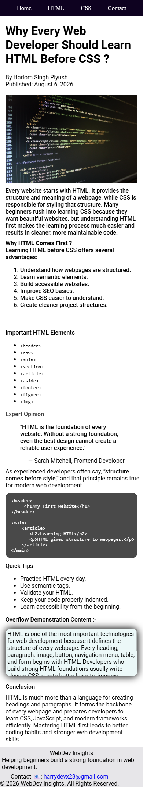

# WebDev-Insights
A responsive HTML5 &amp; CSS3 article page created to practice semantic web development concepts.

> Why Every Web Developer Should Learn HTML Before CSS

---

## Preview



---

## Features

- Semantic HTML5
- Responsive layout
- Navigation bar
- Article section
- Aside section
- Footer
- Blockquote
- Inline quote
- Code snippet
- Ordered & Unordered lists
- Overflow demonstration
- Styled using CSS3

---

## Technologies Used

- HTML5
- CSS3

---

## Folder Structure

```
WebDev-Insights/
│
├── assets/
│   └── images/
│       └── screenshot.png
│
├── index.html
├── style.css
├── README.md
└── LICENSE
```

---

## What I Learned

- Semantic HTML
- CSS Box Model
- Shadows
- Typography
- List Styling
- Overflow
- Responsive Images

---

## Live Demo

Coming Soon (GitHub Pages)

---

## Author

Hariom